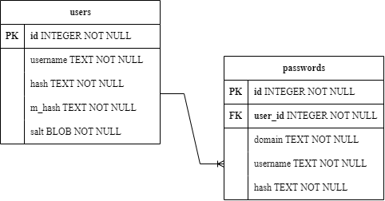

# SafePass – A simple password manager!
## Introduction
This repository was submitted as the final project for CS50X 2023 online course offered by Harvard University. It’s a web application built around Flask’s framework and some software development/web programming languages covered by the course, such as Python, JavaScript, SQL, HTML and CSS. The application is designed for storing passwords.

The central component of the application is the **password vault**, where the user can **store**, **retrieve**, **upload** and **delete** their credentials, which encompass domains, usernames, and passwords. To enable these interactions, the main application is **supported by additional files**, that contain **utilities** and **security** functions.

The project files follow the layout guidelines of [Flask](https://flask.palletsprojects.com/en/2.3.x/tutorial/layout/), but in a simplified manner. The root files are `app.py`, `helpers.py`, `security.py` and `schema.sql`, serving as the **backend** of the application. Regarding the **frontend**, it is divided into two folders: `static` and `templates`. These folders host user-interactive functionality scripts, a style sheet and svgs, and HTML content, respectively.

### Hashing and Encryption
When handling **passwords, storing them directly in the database is _never_ advisable**. Instead, it is essential to hash the password using a robust hashing function. This process renders the password nearly impossible to retrieve without the actual knowledge of the password itself. 

With that in mind, passwords provided by the user during the registration process for the application are hashed through the Argon2[^1] algorithm via a [CFFI library](https://argon2-cffi.readthedocs.io/en/stable/argon2.html).

Regarding user credentials such as domains, usernames and passwords for other sites or applications, an encryption method is applied to ensure their secure[^2] storage in the database. The encryption algorithm is provided by the [Fernet module]( https://cryptography.io/en/latest/fernet/) from the [cryptography library]( https://cryptography.io/en/latest/). 

It involves a symmetric[^3] encryption that requires a passphrase and a random salt to derive a key. This key is used to encrypt data that can only be decrypted by the same key. The uniqueness of a key is directed related to the salt. Consequently, **it is _extremely_ important to _never_ reuse a salt for generating other keys**. This precaution is essential to maintain the security and integrity of the encryption process. 

However, for this method to function properly, it requires the storage of the salt used during the derivation process. This ensures that the same key gets generated by the server, thereby guaranteeing consistent access to the user’s data each time they log in.

Therefore, **to prevent the reuse of the salt**, and subsequently the same encryption key, **a new key is derived each time a user logs in**. The server accomplishes this by decrypting all of the user’s data with the old key during the log in process, deriving a new one with a fresh randomly generated salt, and then encrypting it with the new key. This enhances the security of the process, but leaves the salt vulnerable in the case of a database leak.

To avoid this, the **salt is encrypted** with the `SERVER_KEY` by the same method. 
 
### Database schema
[Flask’s integration with SQLite3]( https://flask.palletsprojects.com/en/2.3.x/patterns/sqlite3/) was employed to serve as the project’s database. It’s a simple relational database featuring a table `users` with a one-to-many relationship with the table `passwords`.

## BackEnd
### [`app.py`](/app.py)
This file is where most of the server logic resides. The first lines of code (1-25) start with the usual import declarations, some server configurations, the definition of the server Fernet key, which is a binary string used for encryption, and a function for closing the database connection when the application context[^4] is popped.

The next lines of code refer to the different routes of the application:
- `register`
- `login`
- `index`
- `import_file`
- `change_password`
- `change_master_password`
- `delete_account`
- `logout`

#### `register`
This route enables user registration in the database. The code starts with a series of “if statements”, to ensure that users cannot proceed with registration unless they provide a username, password and master password. Once the passwords are validated through the `valid_password` function and the username is confirmed to be unique in the database, the user is successfully registered and redirected to the index page, which is the password vault.

Under the hood, just before redirecting the user, a key for encryption is generated from their master password using the Fernet module from the cryptography library. In this module, the key is derived using a salt that is randomly generated by the system. The only way to reproduce the same key is by employing the exact password and salt used during the initial derivation. Thus, for this encryption method, it is imperative to retain both the password and the salt.

Nevertheless, all passwords undergo hashing before being stored in the database. Additionally, the salt is encrypted using the server key and subsequently stored as well.

### `helpers.py`
### `security.py`
### `schema.sql`

## FrontEnd
### `static`
#### JavaScript
#### CSS
### `templates`
#### Layout

## Room for improvement and Vulnerabilities

## Sources

[^1]: The Argon2 algorithm is the winner of the [Password Hashing Competition (PHC)]( https://www.password-hashing.net/), conducted between 2012 and 2015.
[^2]: I’m no expert in cryptography, I only followed the instructions of the module to performs these encryptions. So, when I say “secure” you should take it with a grain of salt, and please do not store your real passwords into this program!
[^3]: Symmetric encryption is a cryptographic technique in which the same key is used for both the encryption and decryption of a message or data.
[^4]: Application context is defined [here](https://flask.palletsprojects.com/en/2.3.x/appcontext/#the-application-context).
