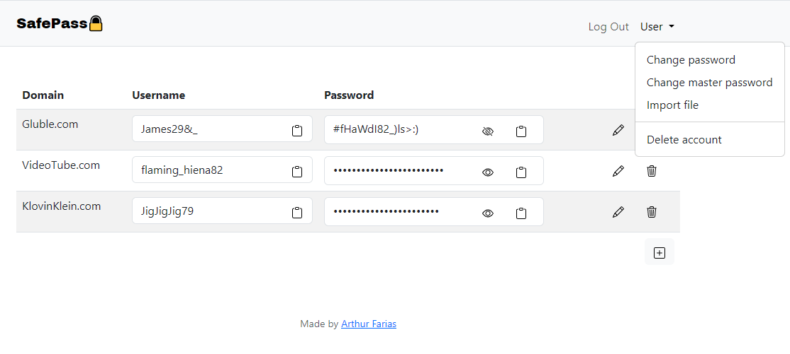

# SafePass – A simple password manager!
## Introduction
This repository was submitted as the final project for CS50X 2023 online course offered by Harvard University. It’s a web application built around Flask’s framework and some software development/web programming languages covered by the course, such as Python, JavaScript, SQL, HTML and CSS. The application is designed for storing passwords.

The central component of the application is the **password vault**, where the user can **store**, **retrieve**, **upload** and **delete** their credentials from other sites or apps, which encompass domains, usernames, and passwords. To enable these interactions, the main application is **supported by additional files**, that contain **utilities** and **security** functions. 

Here's an overview of the interface:



The project files follow the layout guidelines of [Flask](https://flask.palletsprojects.com/en/2.3.x/tutorial/layout/), but in a simplified manner. The root files are `app.py`, `helpers.py`, `security.py` and `schema.sql`, serving as the **backend** of the application. Regarding the **frontend**, it is divided into two folders: `static` and `templates`. These folders host user-interactive functionality scripts, a style sheet and svgs, and HTML content, respectively.

### Hashing and Encryption
When handling **passwords, storing them directly in the database is _never_ advisable**. Instead, it is essential to hash the password using a robust hashing function. This process renders the password nearly impossible to retrieve without the actual knowledge of the password itself. 

With that in mind, passwords provided by the user during the registration process for the application are hashed through the Argon2[^1] algorithm via a [CFFI library](https://argon2-cffi.readthedocs.io/en/stable/argon2.html).

Regarding user credentials such as domains, usernames and passwords for other sites or applications, an encryption method is applied to ensure their secure[^2] storage in the database. The encryption algorithm is provided by the [Fernet module]( https://cryptography.io/en/latest/fernet/) from the [cryptography library]( https://cryptography.io/en/latest/).

It involves a symmetric[^3] encryption that requires a passphrase and a random salt to derive a key. This key is used to encrypt data that can only be decrypted by the same key. The uniqueness of a key is directed related to the salt. Consequently, **it is _extremely_ important to _never_ reuse a salt for generating other keys**. This precaution is essential to maintain the security and integrity of the encryption process.

However, for this method to function properly, it requires the storage of the salt used during the key derivation process. This ensures that the same key gets generated by the server, thereby guaranteeing consistent access to the user’s data each time they log in.

Therefore, **to prevent the reuse of the salt**, and subsequently the same encryption key, **a new key is derived each time a user logs in**. The server accomplishes this by decrypting all of the user’s data with the old key during login, deriving a new one with a fresh randomly generated salt, and then encrypting it with the new key. This enhances the security of the process, but leaves the salt vulnerable in the case of a database leak.

To avoid this, the **salt is encrypted** with the `SERVER_KEY` by the same method.

### Database schema
[Flask’s integration with SQLite3]( https://flask.palletsprojects.com/en/2.3.x/patterns/sqlite3/) was employed to serve as the [project’s database](/schema.sql). It’s a simple relational database featuring a table `users` with a one-to-many relationship with the table `passwords`.


## Backend
### [`app.py`](/app.py)
This file is where most of the server logic resides. The first lines of code (1-25) start with the usual import declarations, some server configurations, the definition of the server Fernet key, which is a binary string used for encryption, and a function for closing the database connection when the application context[^4] is popped.

The next lines of code refer to the different routes of the application:
- [`register`](https://github.com/abfarias/CS50-Final-Project/blob/main/app.py#L123)
- [`login`](https://github.com/abfarias/CS50-Final-Project/blob/main/app.py#L199)
- [`index`](https://github.com/abfarias/CS50-Final-Project/blob/main/app.py#L34)
- [`import_file`](https://github.com/abfarias/CS50-Final-Project/blob/main/app.py#L418)
- [`change_password`](https://github.com/abfarias/CS50-Final-Project/blob/main/app.py#L288)
- [`change_master_password`](https://github.com/abfarias/CS50-Final-Project/blob/main/app.py#L337)
- [`delete_account`](https://github.com/abfarias/CS50-Final-Project/blob/main/app.py#L471)
- [`logout`](https://github.com/abfarias/CS50-Final-Project/blob/main/app.py#L514)

The route names are quite self-explanatory, and some of them share similar code patterns. Instead of providing detailed explanations for each route, I will describe the common patterns they follow while also highlighting any specific features or nuances.

#### `User input validation`
**User input and behavior should never be trusted**. This code pattern is present across all routes (except [`logout`](https://github.com/abfarias/CS50-Final-Project/blob/main/app.py#L514)) and is intended to safeguard the system against malicious user inputs, specifically SQL injection attacks and incorrect/incomplete filling of HTML forms. This is achieved by incorporating placeholders in SQL queries and implementing server-side validation.

The SQL queries are executed by a function called [`query_db`](https://github.com/abfarias/CS50-Final-Project/blob/main/helpers.py#L25) that allows the use of placeholders for queries. The implementation details can be found at [Flask’s website](https://flask.palletsprojects.com/en/2.3.x/patterns/sqlite3/#:~:text=def%20query_db(query%2C%20args%3D()%2C%20one%3DFalse)%3A).

Regarding the HTML forms, every route that is accessed via `POST` begins with a sequence of “if statements” that assess whether the forms have been submitted and whether the provided values are valid. One particular validation used at the [`register`](https://github.com/abfarias/CS50-Final-Project/blob/main/app.py#L123) route is done by a function called [`valid_password`](https://github.com/abfarias/CS50-Final-Project/blob/main/helpers.py#L60). A password and master password are only deemed valid by this function if they contain at least twelve characters, one uppercase letter, one lowercase letter, one number and one special character.

Another specific validation run by the program is done at the [`import_file`](https://github.com/abfarias/CS50-Final-Project/blob/main/app.py#L418) route. In this context, the system must verify whether the file selected by the user is in the right format (CSV files only). The function [`allowed_extension`](https://github.com/abfarias/CS50-Final-Project/blob/main/helpers.py#L50) manages this process, and further implementation details can be found at [Flask’s website]( https://flask.palletsprojects.com/en/2.3.x/patterns/fileuploads/#:~:text=def%20allowed_file(filename)%3A).

#### `DELETE and UPLOAD HTTP methods`
These methods are employed by the [`index`](https://github.com/abfarias/CS50-Final-Project/blob/main/app.py#L34) route, allowing users to both delete and edit their credentials from other sites or applications without the need of another route. This was achieved by sending information to the server via JSON format with the JavaScript method `fetch`[^5].

The information is accessed through the `request.get_json` method, encompassing the credential `id` and the user’s chosen action (delete or update).

#### `Encryption steps`
For the encryption to work, an instance of the `Fernet` class has to be created using the encryption key, as shown below:
```
from cryptography.fernet import Fernet
key = Fernet.generate_key()
f = Fernet(key) 
```
However, **storing this instance in a session for later use across other routes is not viable**. Instead, the generated key must be assigned to a variable and then stored in the session. This approach creates the need to instantiate the Fernet key within the current route whenever there's a need to perform data encryption or decryption.

Having said that, a round of the encryption looks like this:
```
# Encrypt data
user_key = Fernet(session['user_key'])

username = encrypt(user_key, request.form.get('username', type=str))
domain = encrypt(user_key, request.form.get('domain', type=str))
password = encrypt(user_key, request.form.get('password', type=str))

# Save it into the database
query_db('INSERT INTO passwords (user_id, username, domain, hash) VALUES (?, ?, ?, ?)', [session['user_id'], username, domain, password])
```
As for decryption:
```
# Get updated list of passwords
list = query_db('SELECT id, username, domain, hash FROM passwords WHERE user_id = ?', [session['user_id']])

# Decrypt list items
user_key = Fernet(session['user_key'])

for item in list:
    item['username'] = decrypt(user_key, item['username']).decode('utf-8')
    item['domain'] = decrypt(user_key, item['domain']).decode('utf-8')
    item['hash'] = decrypt(user_key, item['hash']).decode('utf-8')
```
These processes are performed quite often and can be found at many `routes`.

### [`helpers.py`](/helpers.py)
This file contains several useful functions that aid the main file objectives. 
Here is the list: 
- [`get_db`](https://github.com/abfarias/CS50-Final-Project/blob/main/helpers.py#L10): Establishes a connection with the SQLite3 database
- [`make_dicts`](https://github.com/abfarias/CS50-Final-Project/blob/main/helpers.py#L16): Dictionary factory, returns rows in the database as dictionaries
- [`query_db`](https://github.com/abfarias/CS50-Final-Project/blob/main/helpers.py#L25): Allows for easy and safe execution of commands in the database 
- [`login_required`](https://github.com/abfarias/CS50-Final-Project/blob/main/helpers.py#L36): Decorates the routes so they can only be accessed when the user is logged in
- [`allowed_extensions`](https://github.com/abfarias/CS50-Final-Project/blob/main/helpers.py#L50): Checks if the file extension is allowed
- [`valid_password`](https://github.com/abfarias/CS50-Final-Project/blob/main/helpers.py#L60): Defines a set of rules a password must follow to be considered valid

All functions above are provided by Flask, with the exception of `valid_password`.

### [`security.py`](/security.py)

## Frontend
### `static`
#### JavaScript
#### CSS
### `templates`
#### Layout

## Room for improvement and Vulnerabilities

## Sources

[^1]: The Argon2 algorithm is the winner of the [Password Hashing Competition (PHC)]( https://www.password-hashing.net/), conducted between 2012 and 2015.
[^2]: I’m no expert in cryptography, I only followed the instructions of the module to performs these encryptions. So, when I say “secure” you should take it with a grain of salt, and please do not store your real passwords into this program!
[^3]: Symmetric encryption is a cryptographic technique in which the same key is used for both the encryption and decryption of a message or data.
[^4]: Application context is defined [here](https://flask.palletsprojects.com/en/2.3.x/appcontext/#the-application-context).
[^5]: [This](https://www.youtube.com/watch?v=cuEtnrL9-H0) is a simple video explaining how to use the `fetch` method.
